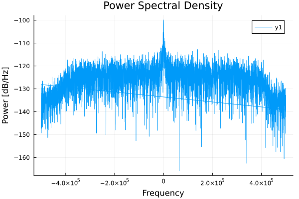
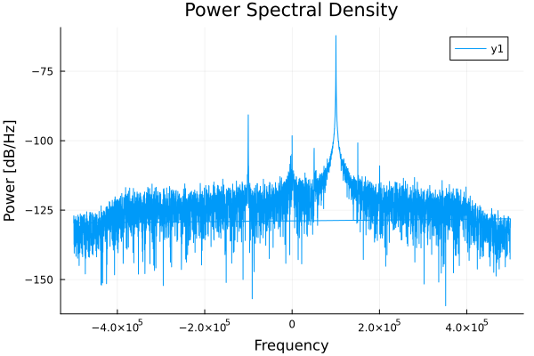
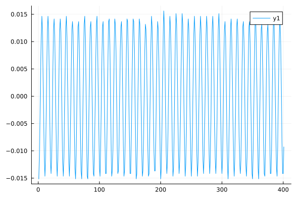

# Receiver

This example configures the BladeRF as a receiver and captures samples on channel 0.
There is a lot of setup, as this is a low-level API.

```jldoctest Receiver; output = false
using ..BladeRF
using DSP
using Plots
ENV["GKSwstype"]="100" # run Plots headless

# Initialize the device
radioBoard = BladeRF.BladeRFDevice();


desired_freq_Hz = round(Int64, 2.4e9);
BladeRF.set_frequency(radioBoard, 0, desired_freq_Hz);

# Get frequency to verify
freq = BladeRF.get_frequency(radioBoard, 0);

# Setting bandwidth
desired_bandwidth_Hz = 500000  # Desired bandwidth in Hz
actual_bandwidth = BladeRF.set_bandwidth(radioBoard, 0, desired_bandwidth_Hz)

# Enable module
BladeRF.enable_module(radioBoard, 0, true)

# Set sample rate
sample_rate_Hz = 1000000
actual_rate_Hz = BladeRF.set_sample_rate(radioBoard, 0, sample_rate_Hz)

# Set gain mode
BladeRF.set_gain_mode(radioBoard, 0, BladeRF.BLADERF_GAIN_MGC)

# Set gain
BladeRF.set_gain(radioBoard, 0, 0)

# output

```

We have configured the receiver, and it's time to set up the sampling.

```jldoctest Receiver; output = false
sample_format = BladeRF.BLADERF_FORMAT_SC16_Q11

num_samples = 4096

bytes_per_sample = 4
buffer_size_samples = 1024
buffer_size = ceil(Int, buffer_size_samples * bytes_per_sample)
read_cycles = ceil(Int, num_samples / (buffer_size / bytes_per_sample))
total_bytes = Int(read_cycles * buffer_size)

received_bytes = Vector{UInt8}(undef, total_bytes)
buf = Vector{UInt8}(undef, buffer_size)
metadata = BladeRF.init_metadata()
timeout_ms = UInt(1000)  # Timeout in milliseconds

channel_layout = BladeRF.BladerfChannelLayout(0)

num_buffers = UInt(32)
blade_buffer_size = UInt(8192)
num_transfers = UInt(16)
stream_timeout = UInt(1000)

BladeRF.sync_config(radioBoard, channel_layout, sample_format, num_buffers, blade_buffer_size, num_transfers, stream_timeout)


BladeRF.enable_module(radioBoard, 0, true)

GC.@preserve buf metadata begin
    buffer_ptr = Base.unsafe_convert(Ptr{Nothing}, pointer(buf))
    metadata_ref = Ref(metadata)
    metadata_ptr = Base.unsafe_convert(Ptr{BladeRF.BladerfMetadata}, metadata_ref)

    # Receive samples
    index = 1
    for i in 1:read_cycles
        BladeRF.sync_rx(radioBoard, buffer_ptr, UInt(buffer_size_samples), metadata_ptr, timeout_ms)
        unsafe_copyto!(received_bytes, index, buf, 1, buffer_size)
        global index += buffer_size
    end
end

BladeRF.enable_module(radioBoard, 0, false)

# Close the device
BladeRF.close(radioBoard)


complex_samples = reinterpret(Complex{Int16}, received_bytes)
normalized_samples = Complex{Float32}.(complex_samples) ./ 2048.0;
println("length(normalized_samples) = ", length(normalized_samples))

# output

length(normalized_samples) = 4096
```

We have now successfully sampled with the radio. To verify the samples, let's plot its Power Spectral Density (PSD).

```jldoctest Receiver; output = false
pgram = periodogram(normalized_samples, onesided=false, fs=actual_rate_Hz)

plot(pgram.freq, pow2db.(pgram.power), title="Power Spectral Density", xlabel="Frequency", ylabel="Power [dB/Hz]")

savefig("src/plots/Receiver_PSD.svg"); nothing

# output

```




The code above has been run with a connected signal generator, supplying a -50 dBm CW tone.
The below Power spectrum shows the received tone, with unwanted mirror and spurs.



To demonstrate the continuity between buffer read cycles (iterations of the for loop), we plot the time-domain signal at the point where two buffer sizes overlap. This allows us to observe the transition between buffers and verify that the signal remains continuous across them.

```julia
plot(real(normalized_samples[800:1200]))
savefig("src/plots/Receiver_time_domain_-50dBm-tone.svg"); nothing
```

