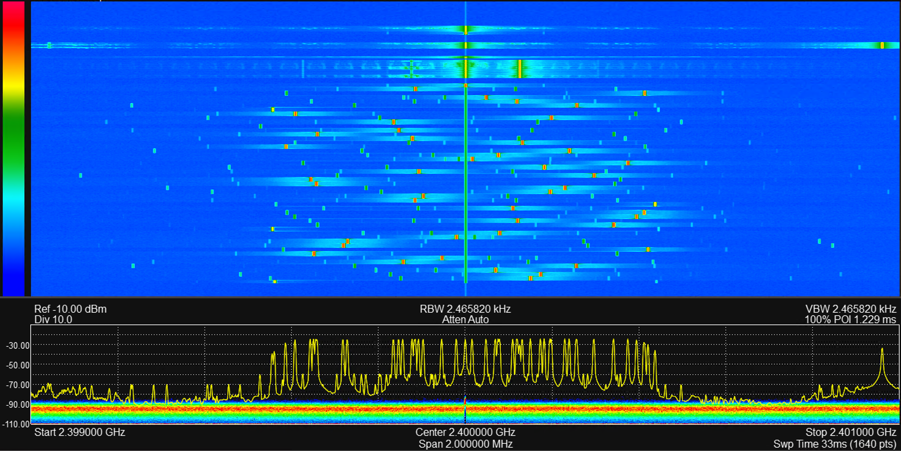

# Transmitter

This example configures the BladeRF as a transmitter and transmit on TX1.
There is a lot of setup, as this is a low-level API.

The bladeRF has a wideband DAC, so lets create ann interresting waveform to transmit.

```jldoctest Transmitter; output = false
using ..BladeRF
using DSP
using Plots
ENV["GKSwstype"]="100" # run Plots headless

# Parameters
sample_rate_Hz = Int(1e6)  # Sample rate
num_samples = Int(10e6)           # Number of samples for the signal
T = num_samples / sample_rate_Hz  # Total time duration of the sweep

# Define frequency range for random selection
f_min = -sample_rate_Hz/2 # Minimum frequency
f_max = sample_rate_Hz/2  # Maximum frequency

# Number of hops (user-defined)
num_hops = 48

# Calculate samples per segment based on the number of hops
samples_per_segment = div(num_samples, num_hops)
remaining_samples = num_samples % num_hops  # In case of leftover samples

# Generate random frequencies for each hop within the specified range
frequencies = rand(f_min:f_max, num_hops)  # Randomly select frequencies in range [-5 MHz, 5 MHz]

# Generate time vector
t = range(0, stop=T, length=num_samples)

# Initialize the signal
hop_signal = zeros(Complex{Float64}, num_samples)

# Generate the frequency hopping signal
for i in 1:num_hops
    segment_start = (i - 1) * samples_per_segment + 1
    if i == num_hops
        segment_end = i * samples_per_segment + remaining_samples  # Include remaining samples in the last segment
    else
        segment_end = i * samples_per_segment
    end
    t_segment = t[segment_start:segment_end]
    freq = frequencies[i]
    
    # Generate constant frequency signal for this segment
    hop_signal[segment_start:segment_end] .= exp.(1im * 2 * pi * freq .* t_segment)
end

nothing

# output

```


As the DAC uses discrete voltage levels, we must convert our normalized waveform to the correct integer type.

```jldoctest Transmitter; output = false
max_12_bit_range = 2048-1  # Maximum range for 12-bit ADC
scaled_signal = hop_signal .* max_12_bit_range

# Convert the signal to Complex{Int16}
# Clip any possible overflows to the valid range
real_scaled_clipped = clamp.(real(scaled_signal), -2048, 2047)
imag_scaled_clipped = clamp.(imag(scaled_signal), -2048, 2047)

global discrete_signal
discrete_signal = Complex{Int16}.(round.(real_scaled_clipped), round.(imag_scaled_clipped))
nothing

# output


```


Now that we have our desired waveform, lets configure the transmitter.

```jldoctest Transmitter; output = false
# Initialize the device
radioBoard = BladeRF.BladeRFDevice();

tx_chanel_1 = 1

desired_freq_Hz = round(Int64, 2.4e9);
BladeRF.set_frequency(radioBoard, tx_chanel_1, desired_freq_Hz);

# Setting bandwidth
desired_bandwidth_Hz = ceil(UInt, 0.8*sample_rate_Hz)  # Desired bandwidth in Hz
actual_bandwidth = BladeRF.set_bandwidth(radioBoard, tx_chanel_1, desired_bandwidth_Hz)

# Enable module
#BladeRF.enable_module(radioBoard, tx_chanel_1, true)

# Set sample rate
actual_rate_Hz = BladeRF.set_sample_rate(radioBoard, tx_chanel_1, sample_rate_Hz)

# Set gain
BladeRF.set_gain(radioBoard, tx_chanel_1, 40)
nothing

# output

```

We have configured the transmitter, and it's time to set up the start the generation.

```jldoctest Transmitter; output = false

sample_format = BladeRF.BLADERF_FORMAT_SC16_Q11

# Transmission parameters
bytes_per_sample = 4  # Each sample is 2 bytes for I and 2 bytes for Q, hence 4 bytes per complex sample
buffer_size_samples = 4096  # Number of complex samples per buffer
read_cycles = ceil(Int, length(discrete_signal) / buffer_size_samples)
total_bytes = Int(read_cycles * buffer_size_samples * bytes_per_sample)


# Calculate total samples required for exact number of buffers
total_samples_required = read_cycles * buffer_size_samples

# Calculate how many samples need to be appended
padding_samples = total_samples_required - length(discrete_signal)

# Append zeroes to discrete_signal (as Complex{Int16} zeros)
if padding_samples > 0
    zero_padding = Complex{Int16}[0 + 0im for _ in 1:padding_samples]  # Create zero complex samples
    discrete_signal = vcat(discrete_signal, zero_padding)  # Append the zeros to the signal
end

# Convert complex samples to UInt8 for transmission
transmit_bytes = reinterpret(UInt8, discrete_signal)

# Metadata and buffer setup
write_buf_size_bytes = buffer_size_samples * bytes_per_sample
write_buf = Vector{UInt8}(undef, write_buf_size_bytes)
metadata = BladeRF.init_metadata()

timeout_ms = UInt(3500)

channel_layout = BladeRF.BladerfChannelLayout(tx_chanel_1)

# Configure BladeRF for transmission
BladeRF.sync_config(
    radioBoard,
    channel_layout,
    sample_format,
    UInt(16), # num_buffers
    UInt(buffer_size_samples), # buffer_size
    UInt(8), # num_transfers
    timeout_ms
)

# Enable transmission on the BladeRF device
BladeRF.enable_module(radioBoard, tx_chanel_1, true)


# Transmit the data in cycles
GC.@preserve write_buf metadata begin
    buffer_ptr = Base.unsafe_convert(Ptr{Nothing}, pointer(write_buf))
    metadata_ref = Ref(metadata)
    metadata_ptr = Base.unsafe_convert(Ptr{BladeRF.BladerfMetadata}, metadata_ref)

    # Transmit samples in chunks of write_buf_size_bytes
    index = 1
    for i in 1:read_cycles
        copy_end = min(index + write_buf_size_bytes - 1, length(transmit_bytes))  # Prevent buffer overflow
        copyto!(write_buf, 1, transmit_bytes, index, copy_end - index + 1)  # Fill buffer with the correct segment
        
        # Transmit the buffer
        BladeRF.sync_tx(
            radioBoard, 
            buffer_ptr, 
            UInt(buffer_size_samples), 
            metadata_ptr, 
            timeout_ms
        )

        # Move the index forward by the size of the transmitted buffer
        global index += copy_end - index + 1
    end
end


BladeRF.enable_module(radioBoard, tx_chanel_1, false)

# Close the device
BladeRF.close(radioBoard)

# output


```

The generated output is captured with a Signal Hound BB60C spectrum analyzer.
The waterfall shows the RF power over time and frequency.

Notice the transmitted tones in the beginning, before the frequency hopping transmission.
These unwanted tones are generated while the BladeRF is being configured.

In the waterfall, we also notice the mirror images of the tones. These are unwanted tones resulting from analog effects such as IQ imbalance.

