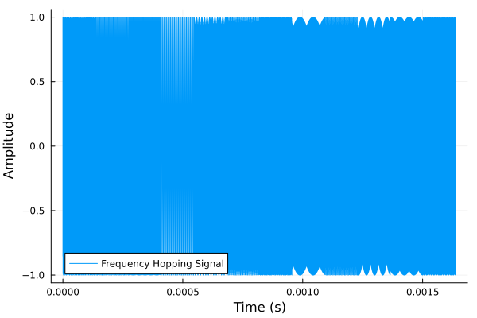

# Transmitter

This example configures the BladeRF as a transmitter and transmit on TX1.
There is a lot of setup, as this is a low-level API.

The bladeRF has a wideband DAC, so lets create ann interresting waveform to transmit.

```jldoctest Transmitter; output = false
using ..BladeRF
using DSP
using Plots
ENV["GKSwstype"]="100" # run Plots headless

# Parameters
sample_rate_Hz = UInt(10e6)  # Sample rate of 10 MHz
num_samples = 2^14           # Number of samples for the signal
T = num_samples / sample_rate_Hz  # Total time duration of the sweep

# Define frequency range for random selection
f_min = -5e6 # Minimum frequency (0.5 MHz)
f_max = 5e6  # Maximum frequency (5 MHz)

# Number of hops (user-defined)
num_hops = 12

# Calculate samples per segment based on the number of hops
samples_per_segment = div(num_samples, num_hops)
remaining_samples = num_samples % num_hops  # In case of leftover samples

# Generate random frequencies for each hop within the specified range
frequencies = rand(f_min:f_max, num_hops)  # Randomly select frequencies in range [-5 MHz, 5 MHz]

# Generate time vector
t = range(0, stop=T, length=num_samples)

# Initialize the signal
hop_signal = zeros(Complex{Float64}, num_samples)

# Generate the frequency hopping signal
for i in 1:num_hops
    segment_start = (i - 1) * samples_per_segment + 1
    if i == num_hops
        segment_end = i * samples_per_segment + remaining_samples  # Include remaining samples in the last segment
    else
        segment_end = i * samples_per_segment
    end
    t_segment = t[segment_start:segment_end]
    freq = frequencies[i]
    
    # Generate constant frequency signal for this segment
    hop_signal[segment_start:segment_end] .= exp.(1im * 2 * pi * freq .* t_segment)
end

# Plot the real part of the hopping signal
plot(t, real(hop_signal), label="Frequency Hopping Signal", xlabel="Time (s)", ylabel="Amplitude")

savefig("src/plots/waveform_to_transmit.svg"); nothing

# output

```



As we can see the time domain signal is kinda useless.
Therefore, lets calculate the power spectrum

```jldoctest Transmitter; output = false
pgram = periodogram(hop_signal, onesided=false, fs=sample_rate_Hz)

plot(pgram.freq, pow2db.(pgram.power), title="Power Spectral Density", xlabel="Frequency", ylabel="Power [dB/Hz]")

savefig("src/plots/waveform_to_transmit_PSD.svg"); nothing

# output

```

As the DAC uses discrete voltage levels, we must convert our normalized waveform to the correct integer type.

```jldoctest Transmitter; output = false
# Scale the signal to fit the Complex{Int16} range [-32768, 32767]
max_int16 = 2^15 - 1  # 32767
scaled_signal = hop_signal .* max_int16  # Scale to range [-32767, 32767]
# Convert the signal to Complex{Int16}
global discrete_signal
discrete_signal = Complex{Int16}.(round.(real(scaled_signal)), round.(imag(scaled_signal)));
println("length(discrete_signal) = ", length(discrete_signal))

# output

length(discrete_signal) = 16384

```


Now that we have our desired waveform, lets configure the transmitter.

```jldoctest Transmitter; output = false
# Initialize the device
radioBoard = BladeRF.BladeRFDevice();

tx_chanel_1 = 1

desired_freq_Hz = round(Int64, 2.4e9);
BladeRF.set_frequency(radioBoard, tx_chanel_1, desired_freq_Hz);

# Setting bandwidth
desired_bandwidth_Hz = 500000  # Desired bandwidth in Hz
actual_bandwidth = BladeRF.set_bandwidth(radioBoard, tx_chanel_1, desired_bandwidth_Hz)

# Enable module
BladeRF.enable_module(radioBoard, tx_chanel_1, true)

# Set sample rate
actual_rate_Hz = BladeRF.set_sample_rate(radioBoard, tx_chanel_1, sample_rate_Hz)

# Set gain
BladeRF.set_gain(radioBoard, tx_chanel_1, 0)

# output

```

We have configured the transmitter, and it's time to set up the start the generation.

```jldoctest Transmitter; output = false
sample_format = BladeRF.BLADERF_FORMAT_SC16_Q11

# Transmission parameters
bytes_per_sample = 4  # Each sample is 2 bytes for I and 2 bytes for Q, hence 4 bytes per complex sample
buffer_size_samples = 2048  # Number of complex samples per buffer
buffer_size = ceil(Int, buffer_size_samples * bytes_per_sample)
num_samples = length(discrete_signal)  # Number of total samples to transmit (from the processed signal)
read_cycles = ceil(Int, num_samples / buffer_size_samples)
total_bytes = Int(read_cycles * buffer_size_samples * bytes_per_sample)


# Calculate total samples required for exact number of buffers
total_samples_required = read_cycles * buffer_size_samples

# Calculate how many samples need to be appended
padding_samples = total_samples_required - length(discrete_signal)

# Append zeroes to discrete_signal (as Complex{Int16} zeros)
if padding_samples > 0
    zero_padding = Complex{Int16}[0 + 0im for _ in 1:padding_samples]  # Create zero complex samples
    discrete_signal = vcat(discrete_signal, zero_padding)  # Append the zeros to the signal
end

# Convert complex samples to UInt8 for transmission
transmit_bytes = reinterpret(UInt8, discrete_signal)

# Metadata and buffer setup
buf = Vector{UInt8}(undef, buffer_size_samples * bytes_per_sample)  # Buffer size in bytes
metadata = BladeRF.init_metadata()
timeout_ms = UInt(1000)  # Timeout in milliseconds


num_buffers = UInt(32)
blade_buffer_size = UInt(2048)
num_transfers = UInt(16)
stream_timeout = UInt(100)

channel_layout = BladeRF.BladerfChannelLayout(tx_chanel_1)

# Configure BladeRF for transmission
BladeRF.sync_config(radioBoard, channel_layout, sample_format, num_buffers, blade_buffer_size, num_transfers, stream_timeout)

# Enable transmission on the BladeRF device
BladeRF.enable_module(radioBoard, tx_chanel_1, true)

# Transmit the data in cycles
GC.@preserve buf metadata begin
    buffer_ptr = Base.unsafe_convert(Ptr{Nothing}, pointer(buf))
    metadata_ref = Ref(metadata)
    metadata_ptr = Base.unsafe_convert(Ptr{BladeRF.BladerfMetadata}, metadata_ref)

    # Transmit samples in chunks of buffer_size
    index = 1
    for i in 1:read_cycles
        copyto!(buf, 1, transmit_bytes, index, buffer_size)
        
        # Transmit the buffer
        BladeRF.sync_tx(radioBoard, buffer_ptr, UInt(buffer_size_samples), metadata_ptr, timeout_ms)

        # Move the index forward
        global index += buffer_size
    end
end

BladeRF.enable_module(radioBoard, tx_chanel_1, false)

# Close the device
BladeRF.close(radioBoard)

# output


```